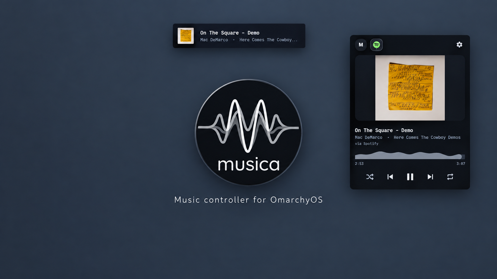

# Musica

<p align="center">
  
</p>

<p align="center">
  Music control for the Omarchy bar.<br>
  A live cava spectrum sits in the bar as the icon; clicking it opens a wide now-playing card.
</p>

It talks MPRIS directly, so it follows Spotify, browser YouTube, and
anything else that exposes the standard Linux media interface.



## Features

- **Bar icon:** live mini-cava, or the song name (switch in settings)
- **Card:** per-source tabs with app icons, big artwork with a fallback
  chain for browsers, wave seek bar, shuffle + repeat that stay dull
  without player support
- **Toast:** cover-left mini card on track change and transport actions,
  click raises the player app
- **Keybinds** ship in the plugin (`SUPER+ALT+P/N/B/S`), plus direct IPC
- **Settings** persist to `shell.json`: bar look, toast on/off + spot,
  and every toggle takes effect instantly

## Install

```sh
omarchy plugin add https://github.com/FearThePLOTO/Musica.git --enable
omarchy bar put io.github.feartheploto.musica --section right
```

Local dev instead: `./scripts/dev-install` (restarts the shell), undo with
`./scripts/dev-uninstall`. Those two helpers are gitignored dev tools,
not part of the plugin.

## Use

- Left click: open/close the card · middle click: play/pause · scroll: prev/next
- Tabs (top, one per source): click to switch source; dot = playing
- Seek bar: drag to move; dull when the player can't seek
- Card keys: `Space` play/pause, `n` next, `p` previous, `s` cycle source,
  `Esc` close, `Tab` hop panels
- Keybinds (opt-in, installed by the plugin itself):

  ```sh
  ./scripts/musica-keybinds install   # SUPER+ALT+P / N / B / S
  ./scripts/musica-keybinds remove
  ```

  Direct IPC also works:
  `omarchy-shell musica playPause|next|previous|cycleSource|toggle`
- Toast stays silent while the card is open. With built-in
  omarchy.media still enabled, its own text OSD fires too; ours
  covers our tab only.

## Requirements

- Omarchy Quattro
- `cava` (optional; without it the bar shows a flat resting icon)
- Any MPRIS player (Spotify, browser, …)

Artwork tries MPRIS art first, then a derived thumbnail (YouTube watch
URLs from browsers that expose no art, e.g. Zen), then the placeholder.

## Remove

```sh
omarchy plugin remove io.github.feartheploto.musica
./scripts/musica-keybinds remove
```

## Trust

Like every Omarchy shell plugin, Musica runs unsandboxed inside the
long-lived shell process with your user permissions — read the code
before enabling, as the installer itself warns. It never asks for sudo,
starts no second Quickshell process, and spawns exactly one helper
process: `cava` for the visualizer (skipped when not installed or when
the bar shows the song name instead). The keybind helper only appends
a marked block to `~/.config/hypr/bindings.lua`; `remove` deletes
exactly that block.
